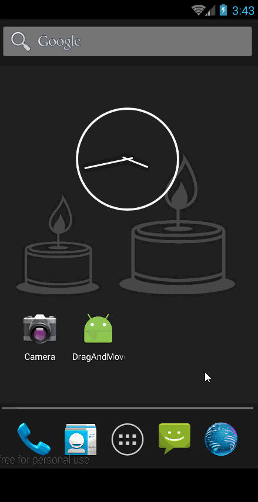

# DragAndMoveView   
这是一个按照手指的滑动轨迹进行移动的自定义控件的 Demo. 实现思路是改变控件的 `MarginLayoutParams` 
的 `leftMargin` 和 `topMargin`. 这种实现方式移动的是控件自身, 所以不论移动到什么位置, 该控件都依然可以响应交互事件. 当然, 也有其他实现方式可以完成类似功能. 其中, 要注意两种情况:
- View动画, 这种方式虽然也能实现控件跟随手指的移动效果, 但其实View动画只是让控件的一个幻影在发生移动, 而控件本身却没有发生移动, 所以在新位置的控件(其实是其幻影)将无法响应交互事件.
- `scrollTo()`, `scrollBy()`: 由于这两个方法移动的是控件的内容, 不是控件本身, 所以如果直接对要移动的控件调用这些方法进行移动, 那么实际上控件本身并不会移动. 只有在要移动的控件外层嵌套一个 ViewGroup, 然后对该ViewGroup调用这些方法, 才能让处于该 ViewGroup内的控件发生移动. 这种方式的缺点是: 灵活性略差, 因为控件只能在 ViewGroup范围内进行移动. 关于 `scrollTo()` 和 `scrollBy()` 的详情示例, 请见[这里](https://github.com/clevergump/Android-Test/tree/master/ScrollTest).

### 该 demo 的介绍   

1. 该 demo 以 [DragAndMoveButton](src/main/java/com/example/drag_and_move_view/widget/DragAndMoveButton.java) 控件为例, 来描述控件随手指的拖动轨迹移动的场景. 
2. 在设置该控件的布局参数时, 要注意某些特殊的参数设置会影响到该控件的自由移动. 例如: 在 `RelativeLayout` 中设置该控件 `android:layout_centerInParent="true"`, 那么该控件将会被一直锁定在屏幕的中央位置而无法跟随手指的移动轨迹自由移动.
3. 在布局文件中的使用:   
	该控件包含如下的自定义属性:
	```xml
    <declare-styleable name="DragAndMoveButton">
        <attr name="minLeftMargin" format="dimension"/>
        <attr name="minTopMargin" format="dimension"/>
        <attr name="minRightMargin" format="dimension"/>
        <attr name="minBottomMargin" format="dimension"/>
    </declare-styleable>
	```
	上述自定义属性的含义是:
	- minLeftMargin: 最小的 leftMargin
	- minTopMargin: 最小的 topMargin
	- minRightMargin: 最小的 rightMargin
	- minBottomMargin: 最小的 bottomMargin

	你可以在你的布局文件中, 按照如下方式来使用该控件:
	```xml
	<com.example.drag_and_move_view.widget.DragAndMoveButton
        android:id="@+id/drag_btn"
        android:layout_width="200dp"
        android:layout_height="50dp"
        android:text="DragAndMoveButton"
        android:gravity="center"
        android:layout_marginTop="50dp"
        android:layout_marginLeft="60dp"
        DragAndMoveButton:minLeftMargin="20dp"
        DragAndMoveButton:minTopMargin="20dp"
        DragAndMoveButton:minRightMargin="20dp"
        DragAndMoveButton:minBottomMargin="20dp"/>
	```


### 通过该demo, 要掌握的知识点:
1. touchSlop (系统能够识别到的最小滑动距离) 的获取方式:

	```java
	int touchSlop = ViewConfiguration.get(getContext()).getScaledTouchSlop();
	```
	只有当滑动距离大于 touchSlop 的时候, 才去响应滑动事件, 这能增强用户体验.
2. `MarginLayoutParams` 这个 `LayoutParams` 的子类在控件连续移动过程中的用法, 欲了解该类的具体细节请查阅源码.
3. 注意 `getX()`与 `getRawX()`, `getY()`与 `getRawY()` 的区别:

	- `getX()` 和 `getY()` 表示手指当前的位置相对于当前控件左上角的 x, y坐标.
	- `getRawX()` 和 `getRawY()` 表示手指当前的位置相对于手机屏幕左上角的 x, y坐标, **既不是相对于该控件左上角的坐标, 也不是相对于该控件所在父容器的左上角的坐标.**
4. View 的加载和 Activity 的加载是异步的, 所以在 Activity中不能直接去获取 View 的宽高以及四条边的坐标, 因为获取时, 该 View 有可能还未加载完毕, 还未加载完毕的 View 所获取到的宽高以及四条边的坐标都为0. 为了确保获取某个 View 的宽高以及四条边的坐标的操作, 一定是在该 View 加载完毕后才去进行, 可以在该 View 的如下回调方法中去获取:

	```java
	view.getViewTreeObserver().addOnGlobalLayoutListener(new ViewTreeObserver.OnGlobalLayoutListener() {
        @Override
        public void onGlobalLayout() {
            view.getViewTreeObserver().removeOnGlobalLayoutListener(this);
            int width = view.getMeasuredWidth();
            int height = view.getMeasuredHeight();
            int left = view.getLeft();
            int top = view.getTop();
            int right = view.getRight();
            int bottom = view.getBottom();
        }
    });
	```

### 运行效果图如下:   

