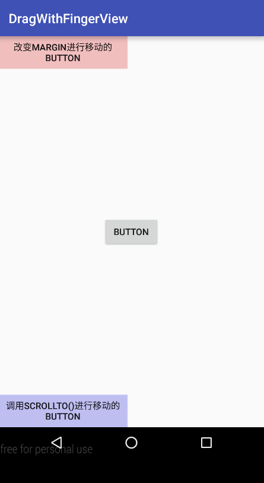

# DragWithFingerView   
这是一个按照手指的滑动轨迹进行移动的自定义控件的 Demo. 实现思路是改变控件的 `MarginLayoutParams` 
的 `leftMargin` 和 `topMargin`. 这种实现方式移动的是控件自身, 所以不论移动到什么位置, 该控件都依然可以响应交互事件. 当然, 也有其他实现方式可以完成类似功能. 其中, 要注意两种情况:
- View动画, 这种方式虽然也能实现控件跟随手指的移动效果, 但其实View动画只是让控件的一个幻影在发生移动, 而控件本身却没有发生移动, 所以在新位置的控件(其实是其幻影)将无法响应交互事件.
- `scrollTo()`, `scrollBy()`: 由于这两个方法移动的是控件的内容, 不是控件本身, 所以如果直接对要移动的控件调用这些方法进行移动, 那么实际上控件本身并不会移动. 只有在要移动的控件外层嵌套一个 ViewGroup, 然后对该ViewGroup调用这些方法, 才能让处于该 ViewGroup内的控件发生移动. 这种方式的缺点是: 灵活性略差, 因为控件只能在 ViewGroup范围内进行移动. 关于 `scrollTo()` 和 `scrollBy()` 的详情示例, 请见[这里](https://github.com/clevergump/Android-Test/tree/master/ScrollTest).

**运行效果图如下:**   

