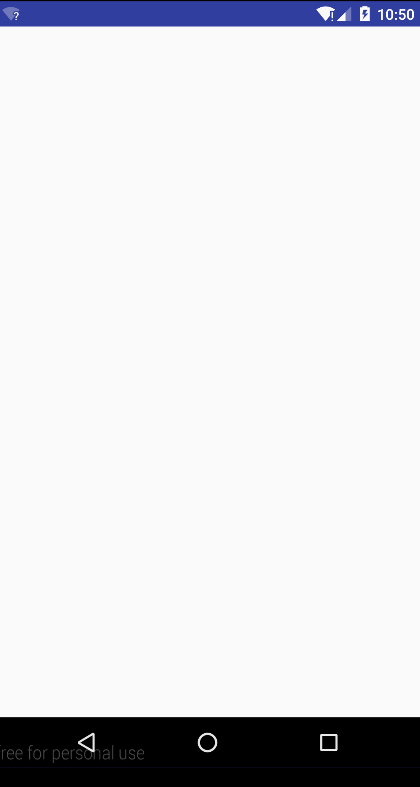

# AndroidCustomViewsDemo
这是 Android 自定义控件的一个 Demo 练习项目. modules 列表如下:

- <a href="#customrectangle">CustomRectangle 自定义矩形</a>
- <a href="#customcircle">CustomCircle 自定义圆</a>


---

## <span id="CustomRectangle">CustomRectangle</span>

####1. **练习的目标:**   
- 一个继承自View类的控件, 需要让 `onMeasure()` 方法处理layout文件中为长宽设置为 `wrap_content` 时的情况 (详情见 
[CustomRectangle1.java][]).
原因请见<a href="http://blog.csdn.net/clevergump/article/details/50545257" target="_blank">这篇文章</a>的分析.
- 自定义属性的用法. (详情见 [CustomRectangle2.java][])
- 绘制矩形时, `Canvas.drawRect(float left, float top, float right, float bottom, Paint paint)` 
方法各参数<font color="red">含义</font>的正确理解. (详情见 [CustomRectangle2.java][])

####2. **注意事项:**   
- 千万不要尝试在代码中直接去获取我们为android系统自带的那些属性在layout文件中所设置的数值, 
尤其是宽高, 因为我们设置的宽高只是我们想要的宽高, 但实际上系统在绘制该控件时可能无法满足我们的要求, 
甚至如果我们设置的宽高是个超级大的数值, 那么也显然无法满足, 其实控件的实际宽高是由我们在layout文件中
设置的想要的宽高和父控件对该控件的限制共同计算出的一个折中数值, 我们可以通过 `getMeasuredWidth()`, 
`getMeasuredHeight()`, `getWidth()`, `getHeight()` 方法来获取到这个折中的数值.
- Canvas.drawRect(float left, float top, float right, float bottom, Paint paint)方法是用来绘制矩形的, 
但是, 我们需要正确理解前四个参数(四个坐标值)的含义.   
    - 如果是使用 `Paint.Style.Fill` 的 `Paint` 绘制矩形, 那么需注意:   
    这四个参数的含义是相对于该矩形自身左上角那个点的水平或垂直距离, 而不是相对于其父控件左上角的点或者手机屏幕左上角的点的距离.   
    - 如果是使用 `Paint.Style.Stroke` 的 `Paint` 绘制矩形(也就是要绘制一个有边框厚度的矩形), 那么需注意:   
    这四个参数的含义是相对于该矩形四条边框各自的中线所组成的矩形的左上角那个点的水平或垂直距离, 而不是相对于其父控件左上角的点或者手机屏幕左上角的点的距离.   

    我们可以用下图来描述上述两种情况:   
    ![canvas.drawRect()的参数说明][CustomRectangle 自定义矩形-canvas.drawRect()的参数说明] 
    
    - 如果是使用 `Paint.Style.Fill` 的 `Paint` 绘制图中内部的那个小矩形(也就是以B点作为左上角的那四条黑线所组成的矩形), 那么该方法中的四个坐标参数就是相对于B点的距离.
    - 如果是使用 `Paint.Style.Stroke` 的 `Paint` 绘制图中用灰色虚斜线表示的矩形, 由于该矩形的四条边都是有厚度的, 所以该方法中的四个坐标参数就是相对于图中红色虚线表示的矩形的左上角那个点(C点)的距离.   

    可以进行对比记忆的是:   
`View` 类的 `getLeft()`, `getRight()`, `getTop()`, `getBottom()` 方法得到的坐标是四条边相对于**<font color="red">父控件</font>**左上角的点的距离.

####3. **运行效果图:**   
![运行效果图][CustomRectangle 自定义矩形-运行效果图]


---

## <span id="CustomCircle">CustomCircle</span>

####1. **注意事项:**   
- 注意圆的半径的正确计算.   
    如果要使用 `Paint.Style.Stroke` 的 `Paint` 来绘制一个有一定边框厚度的圆(此时这个圆属于圆环), 那么在调用 `Canvas.drawCircle(float cx, float cy, float radius, Paint paint)` 方法时, 圆半径 radius 是等于圆心到这个圆环内外两个圆边框正中间的那个中心圆的距离.           
    我们可以用下图来帮助理解:   
    ![使用Stroke的画笔绘制圆][CustomCircle 自定义圆-使用Stroke的画笔绘制圆]   
    如上图所示, 如果我们要使用 `Stroke` 样式的 `Paint` 来绘制上图中边框A和B组成的圆环, 那么我们在调用 `Canvas.drawCircle(float cx, float cy, float radius, Paint paint)` 方法时, 需要传入的半径 `radius` 的数值其实就等于AB两个圆之间的那个红色虚线圆C的半径.

   
####2. **运行效果图:**   
![运行效果图][CustomCircle 自定义圆-运行效果图]

### ProgressCircle
A custom view for showing progress-percentage. Refer [here](https://github.com/clevergump/Android-ProgressCircle) for more details.   



---


[CustomRectangle1.java]: CustomRectangle/src/main/java/com/example/custom_rectangle/widget/CustomRectangle1.java
[CustomRectangle2.java]: CustomRectangle/src/main/java/com/example/custom_rectangle/widget/CustomRectangle2.java
[CustomRectangle 自定义矩形-canvas.drawRect()的参数说明]: CustomRectangle/image/canvas.drawRect()的参数说明.png
[CustomRectangle 自定义矩形-运行效果图]: CustomRectangle/image/运行效果图.png
[CustomCircle 自定义圆-使用Stroke的画笔绘制圆]: CustomCircle/image/使用Stroke的画笔绘制圆.png
[CustomCircle 自定义圆-运行效果图]: CustomCircle/image/运行效果图.gif


> ***GitHub Markdown tips:***   
在使用超链接在文档内部跳转时, 超链接#后边的内容在Github上是有特殊要求的:   
1. 所有 `<span>` 标签的id属性的数值中所有英文都会自动转为小写字母. 所以, 我们在写文档内跳转的超链接时, 需写成如下形式: `<a href="#全部小写字母">`. 例如:   
```html
<a href="#customrectangle">CustomRectangle 自定义矩形</a>
<a href="#customcircle">CustomCircle 自定义圆</a>
```   
<br/>
2. 所有 `<span>` 标签对之间的文字内容如有中文, 则都会在id属性的数值中自动添加该中文, 具体格式待验证. 本文使用的是
```html
<a href="customrectangle-自定义矩形">CustomRectangle 自定义矩形</a>
<a href="#customcircle-自定义圆">CustomCircle 自定义圆</a>
```
